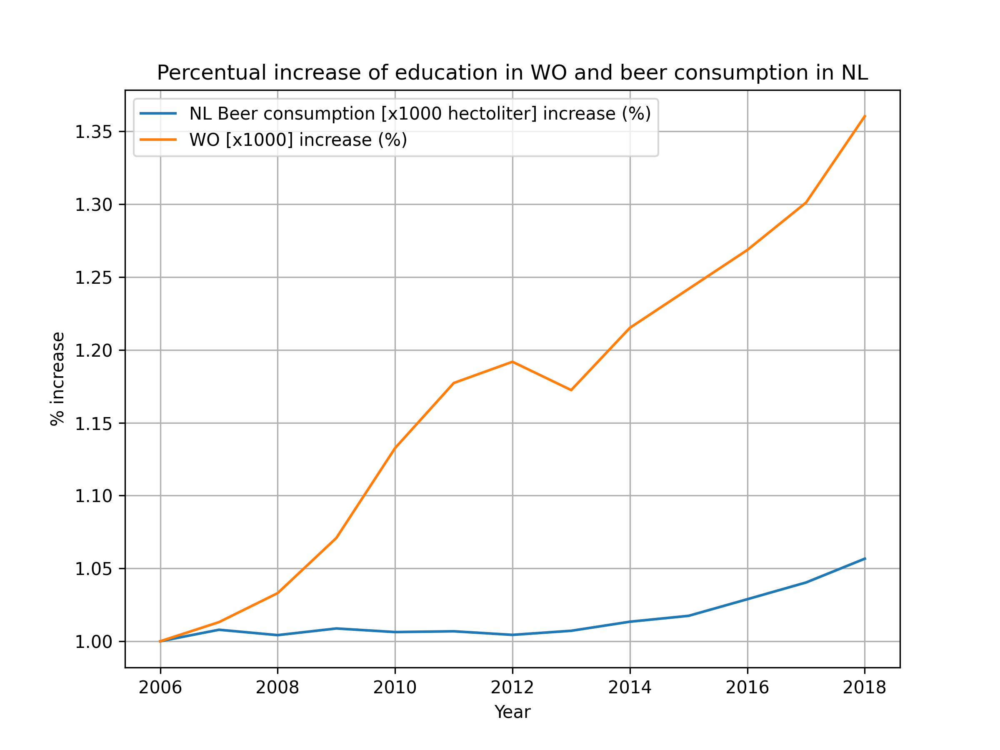

Student ID: 15852431

Titles of relevant papers:

- **The Rise of Coccidioides: Forces Against the Dust Devil Unleashed** (MCC Van Dyke et al., 2019)
- **An analysis of the forces required to drag sheep over various surfaces** (JT Harvey, Applied Ergonomics, 2002)
- **The neurocognitive effects of alcohol on adolescents and college students** (DW Ziegler et al., 2005)

## Education and Beer consumption in NL

The above plot shows the percentual evolution of both WO attendance and beer consumption in the Netherlands between 2006 and 2018.
While both increased in that time span, their evolution is not evidently correlated; we cannot conclude a correlation from the given data. 
